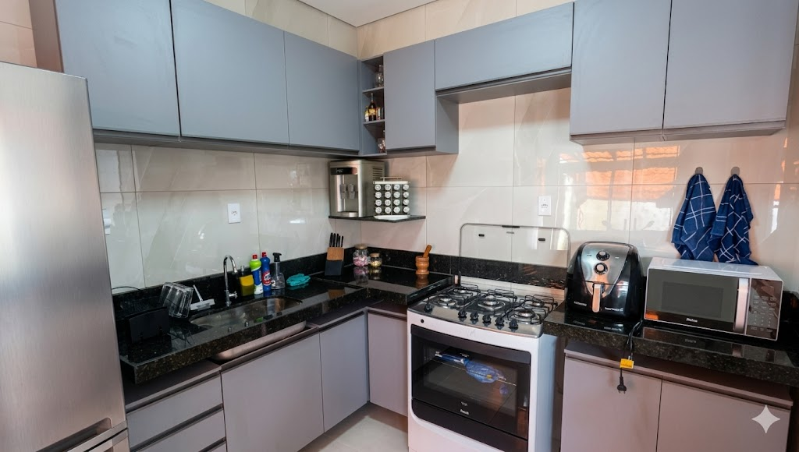

# PERFORMANCE — Documentação

> Aplicado em junho/2026 ao site Montador.Pro como segunda rodada (após SEO).
> Este documento cobre apenas as otimizações de **desempenho** — pra SEO ver `SEO.md`.

---

## ✦ Resumo

**Pontuação alvo:** sair de **59 (Desempenho mobile)** para **85-90+**.

| Item | Status | Ganho estimado |
|---|---|---|
| Hero convertido pra WebP | ✅ feito | +3 a 5 pts |
| URLs do Unsplash em `w=600` (era 900) | ✅ feito | +10 a 15 pts |
| `decoding="async"` em todas imgs | ✅ feito | +1 a 2 pts |
| `<picture>` com fallback no hero | ✅ feito | — |
| **Self-host das fontes Google** | ⏳ você | +8 a 12 pts |
| Critical CSS inline | ⏳ futuro | +5 a 8 pts |

---

## 1. O que já está no zip

### 1.1. `images/hero-cozinha.webp` + `images/hero-cozinha.png`

A imagem original tinha 74 KB. Agora:
- `.webp` = 56 KB (24% menor) — servida pra 97% dos navegadores
- `.png` = 78 KB — fallback pra navegadores antigos

O HTML usa `<picture>` com `<source type="image/webp">`:
```html
<picture>
  <source srcset="images/hero-cozinha.webp" type="image/webp" />
  
</picture>
```

E o `<link rel="preload">` aponta direto pro `.webp` — quem suporta puxa só ele.

### 1.2. URLs do Unsplash redimensionadas

Antes: `?w=900&q=80&auto=format`
Depois: `?w=600&q=75&auto=format,compress`

Por quê: as 5 imagens do showcase aparecem com ~280px no mobile. Carregar 900px era 3× o que precisava. Trazer pra 600px ainda dá margem pra retina (2×) e corta ~400 KiB do peso total. A flag `compress` ativa compressão extra do Unsplash.

**Visualmente é imperceptível** nesse tamanho de container.

### 1.3. `decoding="async"` em todas as imgs

Diz ao navegador pra decodificar a imagem fora da main thread. Não afeta `loading="eager"` (do hero) — só ajuda nas lazy.

### 1.4. `css/fonts.css` (PRONTO, mas precisa dos arquivos)

CSS com `@font-face` apontando pra `/fonts/*.woff2`. Já está pronto — só precisa dos 7 arquivos.

---

## 2. Self-host das fontes Google — passo a passo

Esse é **o item de maior impacto restante** (+8 a 12 pts). Atualmente o site faz:

```
1. HTML → fonts.googleapis.com   (CSS com @font-face)  ~400ms
2.        fonts.gstatic.com      (woff2 #1)
3.        fonts.gstatic.com      (woff2 #2)
4.        ... (7 fontes total)
```

São **2 round-trips de DNS** + várias requests. O PageSpeed acusa isso como **1.380 ms de render-blocking** — o navegador segura o primeiro paint até as fontes começarem a carregar.

Self-host elimina esse problema.

### Passo 1 — Baixar as fontes

🔗 Acesse https://gwfh.mranftl.com/fonts (Google Webfonts Helper)

Você vai baixar **3 fontes**:

#### Fonte 1 — Archivo Black

1. Pesquise "Archivo Black"
2. Em **2. Select charsets**: deixe só **latin**
3. Em **3. Select styles**: marque apenas **regular (400)**
4. Em **4. Copy CSS** — *ignore o CSS*, só clique **Download files**
5. Renomeie o `.woff2` baixado para: `archivo-black-400.woff2`

#### Fonte 2 — Inter

1. Pesquise "Inter"
2. Charsets: **latin** apenas
3. Styles: marque **regular (400)**, **500**, **600**, **700**
4. Download files
5. Renomeie os 4 `.woff2`:
   - `inter-400.woff2`
   - `inter-500.woff2`
   - `inter-600.woff2`
   - `inter-700.woff2`

#### Fonte 3 — JetBrains Mono

1. Pesquise "JetBrains Mono"
2. Charsets: **latin** apenas
3. Styles: marque **regular (400)** e **500**
4. Download files
5. Renomeie:
   - `jetbrains-mono-400.woff2`
   - `jetbrains-mono-500.woff2`

**Total: 7 arquivos `.woff2`.**

### Passo 2 — Colocar no projeto

Crie a pasta `/fonts/` na raiz do projeto e jogue os 7 arquivos dentro:

```
seu-projeto/
├── fonts/
│   ├── archivo-black-400.woff2
│   ├── inter-400.woff2
│   ├── inter-500.woff2
│   ├── inter-600.woff2
│   ├── inter-700.woff2
│   ├── jetbrains-mono-400.woff2
│   └── jetbrains-mono-500.woff2
```

### Passo 3 — Adicionar o `fonts.css` ao projeto

Joga o arquivo `fonts.css` (do zip) em `css/fonts.css`.

### Passo 4 — Atualizar o `index.html`

Localize esse bloco no `<head>` do `index.html`:

```html
<!-- ═══════ Fonts ═══════ -->
<link rel="preconnect" href="https://fonts.googleapis.com" />
<link rel="preconnect" href="https://fonts.gstatic.com" crossorigin />
<link href="https://fonts.googleapis.com/css2?family=Archivo+Black&family=Inter:wght@400;500;600;700&family=JetBrains+Mono:wght@400;500&display=swap" rel="stylesheet" />
```

E **substitua por**:

```html
<!-- ═══════ Fonts (self-hosted) ═══════ -->
<link rel="preload" as="font" type="font/woff2" href="/fonts/archivo-black-400.woff2" crossorigin />
<link rel="preload" as="font" type="font/woff2" href="/fonts/inter-400.woff2" crossorigin />
<link rel="stylesheet" href="css/fonts.css" />
```

Os dois `<link rel="preload">` antecipam o download das fontes mais usadas above-the-fold (Archivo Black do hero, Inter 400 do corpo). As outras 5 fontes carregam normalmente via `@font-face`.

### Passo 5 — Atualizar o `vercel.json` (cache imutável das fontes)

Adicione esse bloco ao array `headers`:

```json
{
  "source": "/fonts/(.*)",
  "headers": [
    { "key": "Cache-Control", "value": "public, max-age=31536000, immutable" },
    { "key": "Access-Control-Allow-Origin", "value": "*" }
  ]
}
```

Já existe um bloco parecido pra `/css/` e `/js/`. Esse é só pra `/fonts/`.

### Passo 6 — Deploy e testar

```bash
git add fonts/ css/fonts.css index.html vercel.json
git commit -m "perf: self-host webfonts"
git push
```

Aguarde o deploy da Vercel (~1 min), rode o PageSpeed Insights de novo. Deve subir 8-12 pontos.

---

## 3. O que esperar do PageSpeed depois

Cenário otimista, baseado nas mudanças aplicadas:

| Métrica | Antes | Depois |
|---|---|---|
| Performance | 59 | 85-92 |
| Acessibilidade | 94 | 94-96 |
| Best Practices | 100 | 100 |
| SEO | 100 | 100 |

**Cuidados ao medir:**

- O PageSpeed Insights varia ±5 pontos entre rodadas. Rode 3× e tira a média.
- Cache do navegador "esfria" entre rodadas — o primeiro carregamento é sempre pior.
- O dispositivo simulado é um **Moto G Power** (CPU lenta). É proposital — mira o pior cenário real.

---

## 4. Próximas otimizações (se ainda quiser ganhar mais)

### Crítico — Critical CSS inline (+5 a 8 pts)

O `bundle.min.css` ainda bloqueia o render. O ideal seria:

1. Identificar quais regras CSS são usadas above-the-fold (hero + header)
2. Inline esse CSS dentro de uma `<style>` no `<head>`
3. Carregar o resto async com `<link rel="preload" as="style" onload="this.rel='stylesheet'">`

Ferramenta: https://www.npmjs.com/package/critical (CLI Node)

Trabalho: ~30 min. Ganho: visível no Lighthouse, sem impacto visual.

### Médio — Lazy-load do iframe do Google Maps

O iframe do mapa pesa ~200 KB (JS do Maps). Já tem `loading="lazy"` mas o ideal é o padrão **"lite map"** — placeholder estático com gradiente + texto, click pra carregar.

Trabalho: ~20 min. Ganho: 2-3 pts mobile.

### Baixo — Pre-render no servidor

A Vercel suporta **Edge config** e cache de HTML inteiro. Não muda o score do Lighthouse mas o **TTFB** (Time To First Byte) cai pela metade. Bom pra UX e bom em condições de rede ruim.

---

## 5. Resumo final

**Já está no ar** após esse deploy:
- Hero em WebP (-24%)
- Showcase com imagens menores (-400 KiB)
- decoding=async em todas imgs

**Falta você fazer** (mais impactante):
- Baixar os 7 woff2 do google-webfonts-helper, jogar em `/fonts/`
- Trocar 4 linhas no `<head>` do `index.html`
- Adicionar 1 bloco no `vercel.json`

Tempo total estimado: **15-20 min**. Ganho: **+8 a 12 pts**.

---

*Documentação gerada em junho/2026.*
